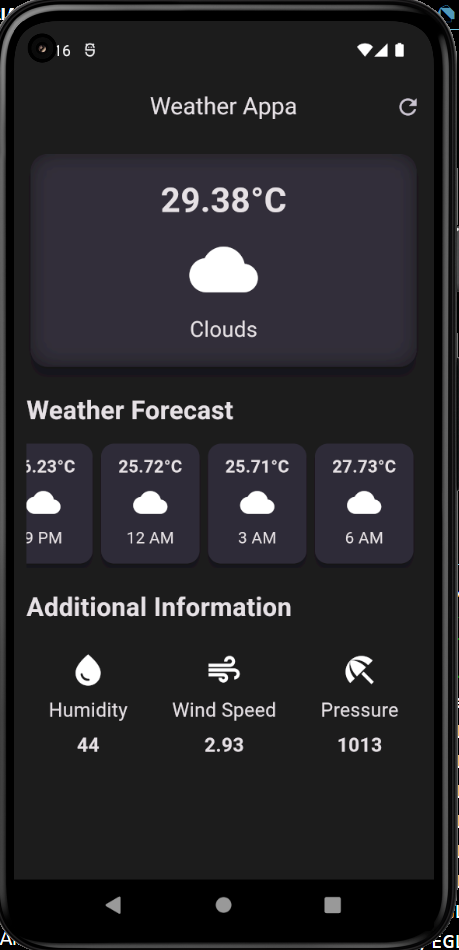
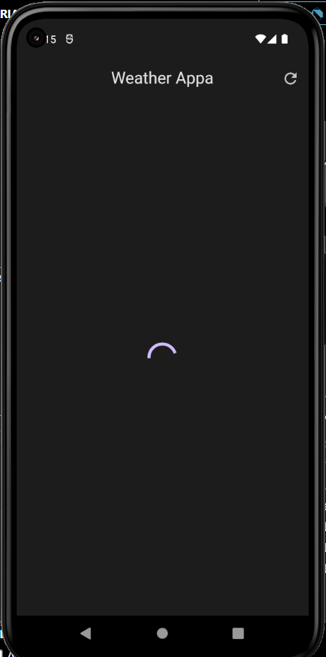

<h1>Weather APP</h1>

<h5> This project goal was to fetch some data using weather API and learn how data is fetched and used in mobile apps.</h5>

<h3>Future Updates will contain:</h3>
<ul>
  <li>Animation screen according to weather.</li>
  <li>Notification for forecasting related in a Fun way. </li>
  <li>Top 5 cities with highest temperature in world currently</li>
  <li>Top 5 cities with lowest temperature in world currently</li>
  <li>......</li>
</ul>

<h2>Screenshots of App:</h2>

